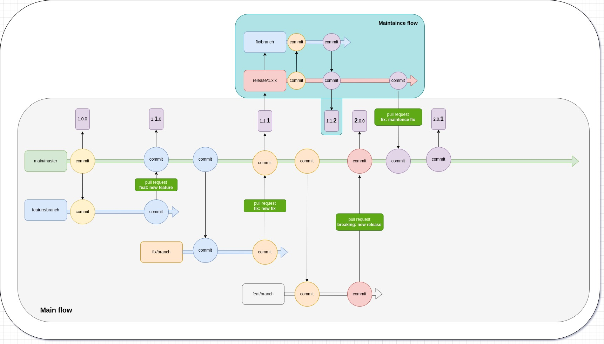

# Git flow



## Git flow description

### Branch naming

- Default branch for release **main/master**
- Maintenance branch for support releases **release/1.x**, **release/2.x** end etc
- Branch for development **feature/ticket** id for example **feature/INFRA-12**
- Branch for fix **fix/ticket** id for example **fix/INFRA-12**

### Release naming

> v1.2.9

```
v - prefix 1 - major 2 - minor 9 - patch
```

### Requirements for commits naming

If we want to get well changelogs we need to adhere to the following rules of commits naming.

```commandline
breaking: New release name  - Major release
feat: My feature name       - Minor release
fix: My fix name            - Patch release
refactor: My refactor name  - Patch release
security: My security issue - Patch release
style: Style name           - Patch release
chore: Chore name           - Without release
ci: CI fix                  - Without release
docs: Add docs              - Without release
test: Add tests             - Without release
```

### Environments

We have 2 environments:

```commandline
dev
production
```

#TODO flow description

# CI/CD flow


